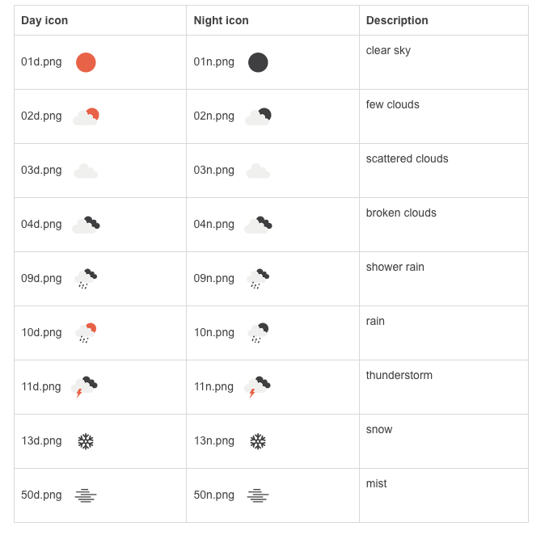
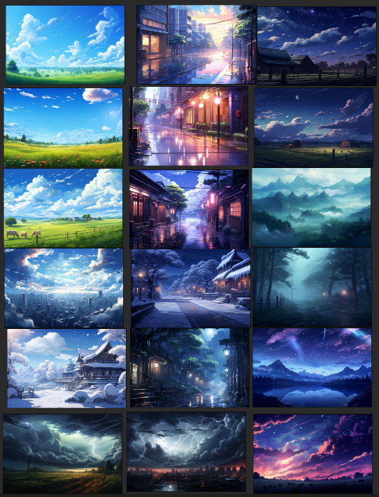
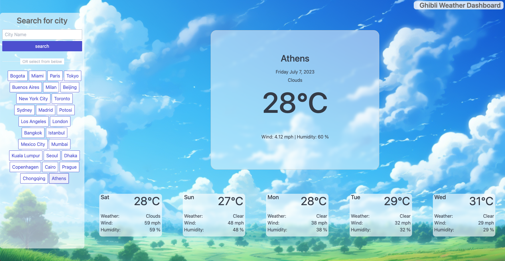
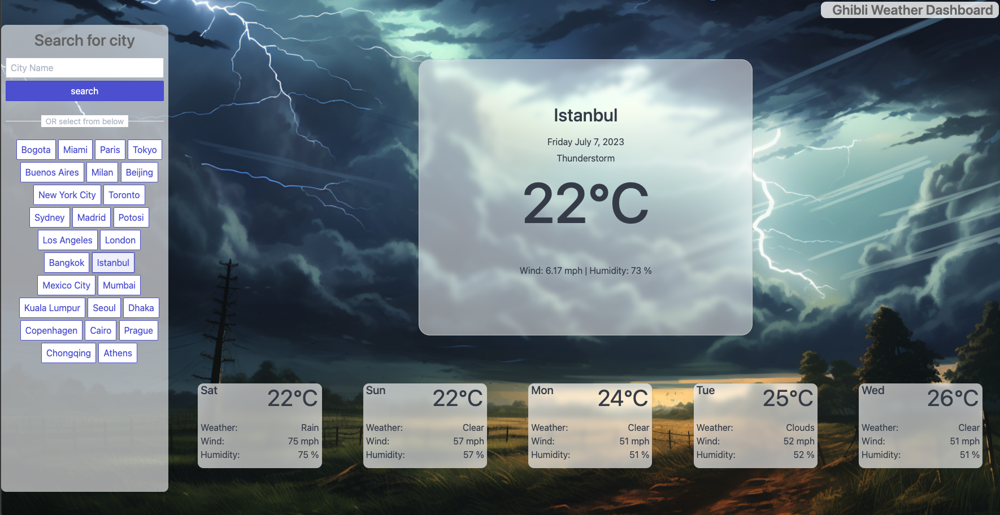
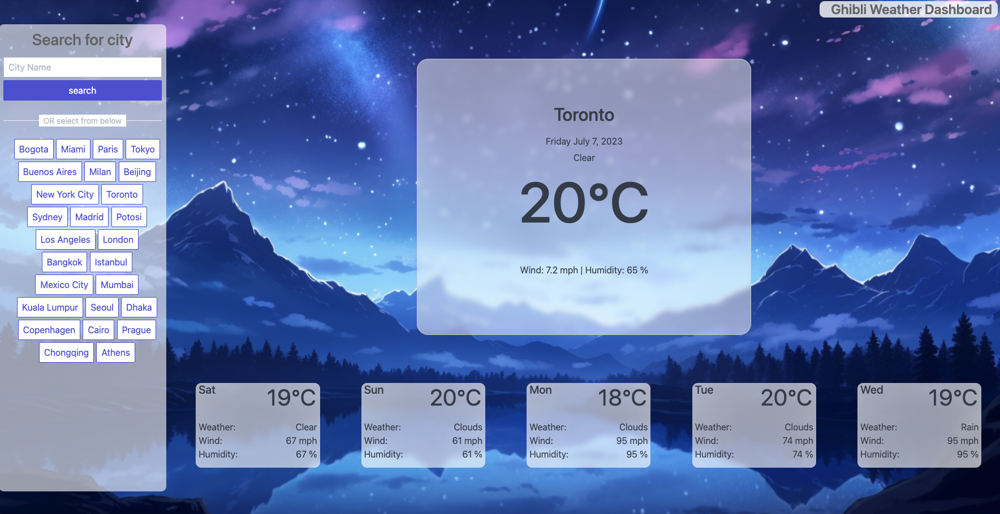
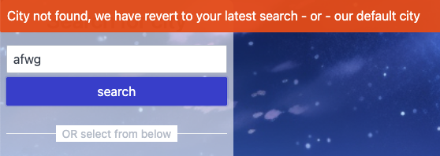

# Ghibli Weather Dashboard

Weather dashboard inspired by the Studio Ghibli animation studio  

## Description

- This weather dashboard uses two apis (current weather and 5 days forecast) both from OpenWeather.
- The user is able to search any city or use the pre existing buttons to select a city.
- Information display are: City name, temperature in Celsius, wind speed, humidity percentage, and instead of an icon an image inspired by the Studio Ghibli will display to match the weather.
- The latest city is saved in localstorage
- I decided to pre-select some cities instead of showing the history for the user to be able to easily change cities and see different images

## Image instead of Icons

Using the 18 icons that the api returns, I swap them, for images to display in the background

 
  

## Environments

You can view the live demo using this link https://felipewithf.github.io/WeatherApp/

## Screenshots

Image background matches the current weather of the city

 
  
   

## Tests

- Check the demo at different times of the day ( day and night) to view image change from day to night
- Check different cities across the world to see their weather
- Type any city in the search box to see that city's weather
- Select from the pre-selected buttons to the city's weather
- Refresh the page and see how the latest city searched is stored in your browser
- Type an invalid city and an Error toast UI will appear -  handling respons 404 from api
 

## time estimates

7 hours